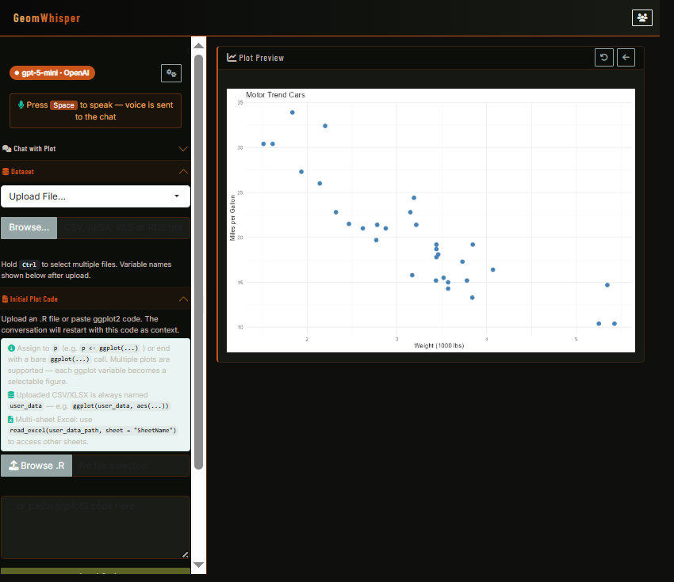

# GeomWhisper

GeomWhisper is a locally runnable Shiny application for conversational and
voice-driven ggplot2 refinement powered by your choice of LLM provider.

Voice-controlled ggplot2 modification is powered by your choice of LLM provider
- OpenAI, Anthropic, Google Gemini, or a local Ollama model.

## First Look



Start a project by choosing **Upload File...** in **Dataset** and uploading one
or more CSV, XLSX, XLS, or RDS files. The first file is available as `user_data`;
each uploaded file is also available under a valid R variable name derived from
its filename and shown in the Dataset panel. Then upload an `.R` script in
**Initial Plot Code** or paste ggplot2 code before asking GeomWhisper to refine
the visualization.

## Architecture

```
Browser (Shiny UI)
  └─ Web Speech API (JS)       ← free, no API key, Chrome/Edge only
       │ voice transcript
       ▼
  Shiny Server (R)
       │ ellmer (R package)
       ▼
  LLM Provider API              ← OpenAI / Anthropic / Google Gemini / Ollama
       │ tool call → R code
       ▼
  eval() → renderPlot() → back to browser
```

## Prerequisites

| Tool | Version | Install |
|------|---------|---------|
| **R** | ≥ 4.4 | https://cran.r-project.org |
| **Chrome or Edge** | Latest | Required for Web Speech API |
| **API key** | Provider-specific | See [Choose your LLM provider](#2-choose-your-llm-provider) below |

## Quick Start

### 1. Installation

**Windows:** Run the installer (`setup_ggplot Voice Copilot (Multi-LLM).exe`)
- Detects compatible R installations and, when needed, offers to download the latest R from CRAN (R 4.4+ required; internet access is required)
- Installs missing R packages when the app first starts (CRAN access required)

**Manual installation:** Install R 4.4 or later. Missing R packages are
installed on first startup when an internet connection is available.

### 2. Choose your LLM provider

When you launch the app, select one:
- **OpenAI** — Requires: [API key](https://platform.openai.com/api-keys)
- **Anthropic** — Requires: [API key](https://console.anthropic.com)
- **Google Gemini** — Requires: [API key](https://aistudio.google.com/apikey)
- **Ollama** — Requires: [Ollama running locally](https://ollama.ai) (`ollama serve`)

### 3. Run

**Windows:**
```cmd
start.bat
```

**Manual (any OS):**
```bash
Rscript -e "shiny::runApp('.', port = 7475, host = '127.0.0.1', launch.browser = TRUE)"
```

Open **http://127.0.0.1:7475** in Chrome or Edge.

## Data and Plot Code

- Upload requests are limited to 50 MB. You can upload multiple CSV, XLSX, XLS, or RDS files in one selection.
- Excel files load their first sheet by default. For additional sheets in the first uploaded Excel file, use `readxl::read_excel(user_data_path, sheet = "SheetName")` in plot code.
- A single plot script must assign a ggplot object to `p` or end with a bare `ggplot(...)` expression. Scripts may define multiple ggplot objects; the app exposes them as selectable figures.
- Export the active plot as PNG, PDF, or SVG from the **Export Plot** panel.

## Usage

1. Press the **Space bar** to begin voice input. When recognition finishes, your
     spoken command is sent to the chat automatically. Voice controls work in Chrome
     or Edge when the cursor is not in a text field.

2. Or **type a command** in the chat box and click Send.

3. The plot updates in real time. Use **Undo** to revert and **Reset** to return
     to the default plot.

## Local Settings and Code Execution

Provider settings, including API keys, are saved in a local R user configuration
file so they can be restored on the next launch. The file is JSON and is not
encrypted; use an operating-system account you trust and revoke or rotate keys
that may have been exposed.

The app evaluates uploaded and model-generated R code in its local R process to
render plots. Only upload scripts and use model providers that you trust.

## Rate Limits

Provider pricing and quotas change over time. Consult the current provider
documentation for [OpenAI](https://openai.com/pricing),
[Anthropic](https://www.anthropic.com/pricing), and
[Google Gemini](https://ai.google.dev/gemini-api/docs/pricing). Ollama has no
hosted-provider quota, but local capacity depends on the selected model and
your hardware.

## Reviewer-Friendly Verification

Run the offline smoke test:

```bash
Rscript tests/offline_smoke.R
```

This check validates core local helpers without requiring live API keys.

## Support and Contribution

- Contribution guidance is in `CONTRIBUTING.md`.
- The software citation metadata is in `CITATION.cff`.
- The JOSS manuscript scaffold is in `paper/paper.md` with references in `paper/paper.bib`.
- The repository is licensed under GPL-3.0; see `LICENSE`.
- Once the repository is public, issues and support requests should go through
     the public issue tracker.

## Project Structure

```
repo/
├── .github/
│   └── workflows/
│       ├── draft-pdf.yml        # JOSS draft PDF build
│       └── r-review-checks.yml  # Offline CI smoke test
├── paper/
│   ├── images/
│   │   └── geomwhisper_screenshot.png  # Figure for manuscript
│   ├── paper.bib             # JOSS bibliography
│   └── paper.md              # JOSS manuscript draft
├── www/
│   ├── speech.js         # Browser Web Speech API integration
│   └── styles.css        # UI styles
├── tests/
│   └── offline_smoke.R   # Offline helper verification
├── skills/
│   ├── apa.md            # APA journal style skill
│   └── nature.md         # Nature journal style skill
├── CITATION.cff          # Software citation metadata
├── CONTRIBUTING.md       # Contribution and support guidance
├── global.R              # Shared config, chat creation, tool definitions
├── LICENSE               # GPL-3.0 license
├── ui.R                  # Shiny UI
├── server.R              # Shiny server
├── launch.ps1            # Windows PowerShell launcher (R detection, package install)
├── start.bat             # Windows launcher entry point
└── README.md
```
